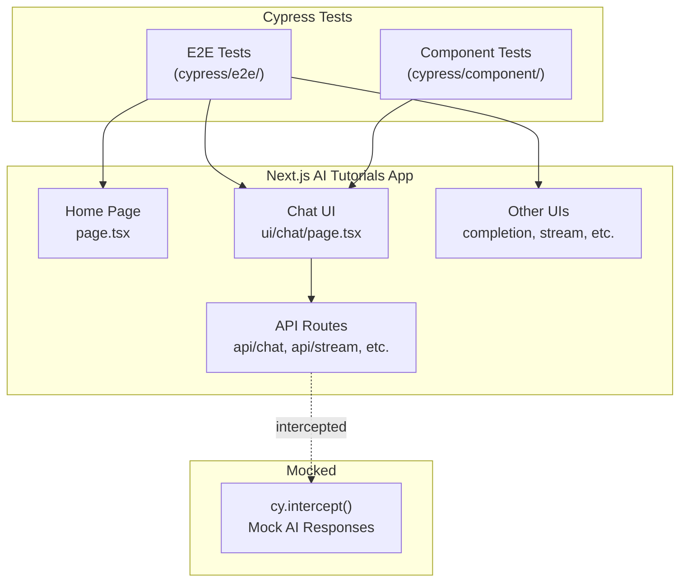

# Cypress Testing for Next.js — Complete Guide

## 1. What is Cypress?

**Cypress** is an open-source, JavaScript-based **end-to-end (E2E) testing framework** that runs tests directly in a real browser. Unlike Selenium-based tools, Cypress operates *inside* the browser alongside your application, giving it native access to the DOM, network requests, and everything happening in the app.

### Key Characteristics

| Feature | Description |
|---|---|
| **Real Browser Testing** | Tests run in Chrome, Firefox, Edge — no WebDriver needed |
| **Time Travel** | Cypress snapshots the DOM at each step; you can hover over commands to see exactly what happened |
| **Automatic Waiting** | No need for `sleep()` or manual waits — Cypress automatically waits for elements, animations, and network requests |
| **Network Stubbing** | Intercept and mock API calls with `cy.intercept()` |
| **Component Testing** | Can test individual React components in isolation (since Cypress 10+) |
| **Visual Test Runner** | Provides a beautiful interactive GUI to watch tests run in real-time |

### Cypress vs Other Testing Tools

| | **Cypress** | **Playwright** | **Jest + RTL** |
|---|---|---|---|
| **Type** | E2E + Component | E2E + API | Unit + Integration |
| **Runs in** | Real browser | Real browser (headless default) | jsdom (simulated) |
| **Best for** | User flow testing | Cross-browser E2E | Logic & component unit tests |
| **Next.js Support** | Official Next.js docs recommend it | Also officially recommended | Built-in with `create-next-app` |
| **Learning Curve** | Easy | Moderate | Easy |

---

## 2. How to Write Cypress Tests for a Next.js App (Overall)

### Step 1: Install Cypress

```bash
npm install --save-dev cypress
```

### Step 2: Add Cypress Scripts to [package.json](file:///c:/Space/workspaces/nextjs-projects/Next.js-AI-Tutorials/package.json)

```json
{
  "scripts": {
    "dev": "next dev",
    "build": "next build",
    "start": "next start",
    "cypress:open": "cypress open",
    "cypress:run": "cypress run"
  }
}
```

- `cypress:open` — Opens the **interactive Test Runner** (GUI)
- `cypress:run` — Runs tests **headlessly** in CI/CD

### Step 3: Initialize Cypress

```bash
npx cypress open
```

This creates the following folder structure:

```
cypress/
├── e2e/                    # Your E2E test files go here
│   └── example.cy.ts
├── fixtures/               # Mock data (JSON files)
│   └── example.json
├── support/
│   ├── commands.ts         # Custom Cypress commands
│   └── e2e.ts              # Global hooks & setup
cypress.config.ts           # Cypress configuration file
```

### Step 4: Configure Cypress for Next.js

```typescript
// cypress.config.ts
import { defineConfig } from "cypress";

export default defineConfig({
  e2e: {
    baseUrl: "http://localhost:3000",   // Your Next.js dev server
    viewportWidth: 1280,
    viewportHeight: 720,
    setupNodeEvents(on, config) {
      // Node event listeners here
    },
  },
  // Optional: Component testing config
  component: {
    devServer: {
      framework: "next",
      bundler: "webpack",
    },
  },
});
```

### Step 5: Write Your First E2E Test

```typescript
// cypress/e2e/home.cy.ts
describe("Home Page", () => {
  beforeEach(() => {
    cy.visit("/");
  });

  it("should display the Next.js logo", () => {
    cy.get('img[alt="Next.js logo"]').should("be.visible");
  });

  it("should have a 'Deploy now' link", () => {
    cy.contains("Deploy now")
      .should("have.attr", "href")
      .and("include", "vercel.com");
  });

  it("should have a 'Read our docs' link", () => {
    cy.contains("Read our docs")
      .should("have.attr", "href")
      .and("include", "nextjs.org/docs");
  });
});
```

### Step 6: Run Tests

```bash
# 1. Start your Next.js dev server first
npm run dev

# 2. In another terminal, open Cypress
npm run cypress:open
```

---

### Common Cypress Patterns for Next.js

#### Pattern 1: Testing Navigation (App Router)

```typescript
describe("Navigation", () => {
  it("should navigate to the chat page", () => {
    cy.visit("/");
    cy.get('a[href="/ui/chat"]').click();
    cy.url().should("include", "/ui/chat");
    cy.contains("How can I help you?"); // placeholder text
  });
});
```

#### Pattern 2: Mocking API Routes with `cy.intercept()`

This is **critical** for a Next.js AI app — you don't want to call real AI APIs during testing!

```typescript
describe("Chat Page", () => {
  beforeEach(() => {
    // Intercept the AI chat API and return a mock response
    cy.intercept("POST", "/api/chat", {
      statusCode: 200,
      body: "This is a mocked AI response.",
    }).as("chatRequest");

    cy.visit("/ui/chat");
  });

  it("should send a message and display the response", () => {
    cy.get('input[placeholder="How can I help you?"]')
      .type("What is TypeScript?");

    cy.contains("Send").click();

    cy.wait("@chatRequest");
    cy.contains("AI:").should("exist");
  });
});
```

#### Pattern 3: Testing Form Interactions

```typescript
it("should clear the input after submitting", () => {
  cy.get("input").type("Hello AI");
  cy.contains("Send").click();
  cy.get("input").should("have.value", "");
});
```

#### Pattern 4: Testing Loading States

```typescript
it("should show a spinner while waiting for AI response", () => {
  cy.intercept("POST", "/api/chat", (req) => {
    // Delay the response to test loading state
    req.reply({
      delay: 2000,
      statusCode: 200,
      body: "Delayed response",
    });
  });

  cy.visit("/ui/chat");
  cy.get("input").type("Hello");
  cy.contains("Send").click();

  // The Stop button should appear during streaming
  cy.contains("Stop").should("be.visible");
});
```

#### Pattern 5: Testing Error States

```typescript
it("should display an error when the API fails", () => {
  cy.intercept("POST", "/api/chat", {
    statusCode: 500,
    body: "Internal Server Error",
  });

  cy.visit("/ui/chat");
  cy.get("input").type("Hello");
  cy.contains("Send").click();

  cy.get(".text-red-500").should("be.visible");
});
```

---

## 3. Cypress Tests for the Next.js AI Tutorials App

**Yes, absolutely!** Your app is a great candidate for Cypress testing. Here's a breakdown of what can be tested:

### 🗂️ Your App Structure (Testable Areas)

```
src/app/
├── page.tsx                      ← Home page (static content)
├── api/
│   ├── chat/route.ts             ← Chat API endpoint
│   ├── completion/               ← Text completion API
│   ├── stream/                   ← Streaming API
│   ├── structured-data/          ← Structured output API
│   ├── generate-image/           ← Image generation API
│   ├── generate-speech/          ← Speech generation API
│   ├── tools/                    ← Tool-use API
│   ├── embeddings/               ← Embeddings API
│   └── ... (22 API routes)
├── ui/
│   ├── chat/page.tsx             ← Chat UI
│   ├── completion/               ← Completion UI
│   ├── stream/                   ← Stream UI
│   ├── structured-data/          ← Structured data UI
│   ├── generate-image/           ← Image generation UI
│   └── ... (20 UI pages)
└── test/                         ← Existing test page
```

### ✅ What to Test

| Test Category | What to Test | Cypress Technique |
|---|---|---|
| **Home Page** | Logo, links, layout renders correctly | `cy.visit("/")`, `cy.contains()` |
| **Chat UI** | Type message → send → see response | `cy.intercept("POST", "/api/chat")` — mock the AI response |
| **Completion UI** | Input prompt → receive completion | `cy.intercept()` the completion API |
| **Image Generation UI** | Submit prompt → display image | Mock the API to return a test image URL |
| **Streaming UI** | Verify streaming behavior & Stop button | `cy.intercept()` with delay, test loading states |
| **Error Handling** | API returns 500 → error message shown | `cy.intercept()` with error status |
| **Navigation** | Click links → navigate between pages | `cy.get("a").click()`, `cy.url().should()` |
| **Form Validation** | Disabled state when not ready | `cy.get("button").should("be.disabled")` |

### 🚫 What NOT to Test with Cypress

- **Real AI API calls** — Always mock with `cy.intercept()`. Real calls are slow, costly, and non-deterministic.
- **Server-side logic internals** — Use Jest/Vitest for unit testing route handlers.
- **Third-party services** (OpenAI, Anthropic) — Mock at the network level.

### Architecture Overview



---

## Quick Start Summary

If you'd like me to **set up Cypress in your project right now**, here's what I would do:

1. **Install** `cypress` as a dev dependency
2. **Create** `cypress.config.ts` with your Next.js settings
3. **Create** `cypress/e2e/` test files for:
   - `home.cy.ts` — Home page tests
   - `chat.cy.ts` — Chat page tests (with mocked AI API)
   - `navigation.cy.ts` — Page-to-page navigation tests
4. **Add** `cypress:open` and `cypress:run` scripts to [package.json](file:///c:/Space/workspaces/nextjs-projects/Next.js-AI-Tutorials/package.json)
5. **Add** `cypress/` entries to [.gitignore](file:///c:/Space/workspaces/nextjs-projects/Next.js-AI-Tutorials/.gitignore) as needed

> [!TIP]
> Would you like me to go ahead and set up Cypress with working test files for your Next.js AI Tutorials app? Just say the word! 🚀
